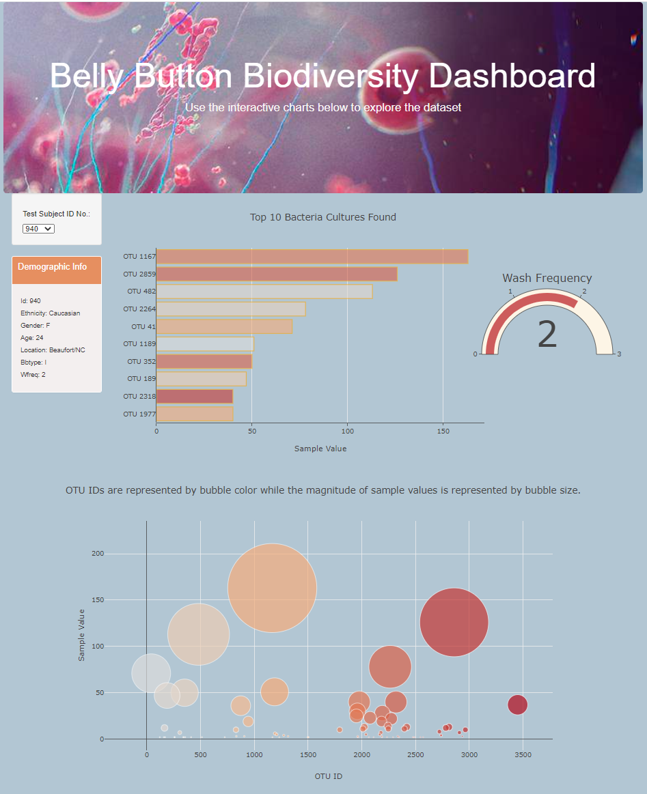

# plotly-challenge

<html>

             
<body>

Plotly, JavaScript, HTML, and CSS, and D3.js are used to create interactive charts for a bacteria dataset.  The table can be filtered by test subject ID from the dropdown menu located in left hand navigation menu: <a href="https://danawoodruff.github.io/plotly-challenge/">View GitHub-Page</a> 

Once the user has selected a test subject the, at a maximum, top ten bacterium found in the test subject's bellybutton will be displayed as a bar and a bubble chart. The Wash Frequency is displayed as a gauge chart to allow the user to determine whether there is a correlation between bathing and bacteria volume.

To view the JavaScript code: [JavaScript Code](static/bonus.js) 
to view the CSS code: [CSS Code](static/styleSheet.css) 
To view the HTML code: [HTML Code](index.html)

</body>
</html>
